## Overview

The goal of this is to document my steps for installing Gentoo on my machine. In general, I want to install a [Distribution Kernel](https://wiki.gentoo.org/wiki/Distribution_Kernel), KDE plasma, OpenRC, and a [Binary Host Setup](https://wiki.gentoo.org/wiki/Gentoo_Binary_Host_Quickstart).

I'm open to critique and general pointers for improvements as I document this. Of course I will use the [Gentoo Handbook](https://wiki.gentoo.org/wiki/Handbook:AMD64) as my primary reference.

**Warning: Keep in mind, I'm documenting exactly what I did for my particular system at the time. Thus, when working on a different machine at a different time, dependencies could likely change and these exacts may not work exactly how it did at the time of this document. So, use your judgement!**

## Installing on Virtual Machine

I want to start installing this on a Virtual Machine. I'm doing this on a CachyOS host with a QEMU+KVM virtual machine:

### <ins>Getting ISO</ins>

First thing is to get the AMD64 minimalist ISO from [Gentoo's website](https://www.gentoo.org/downloads/amd64/).

After acquiring the ISO, I created a new VM using [Virtual Machine Manager](https://virt-manager.org/):
- CPUs: 4
- RAM: 8 GiB
- Storage: 400 GiB
- Video: VirtIO
- Display: SPICE
    - 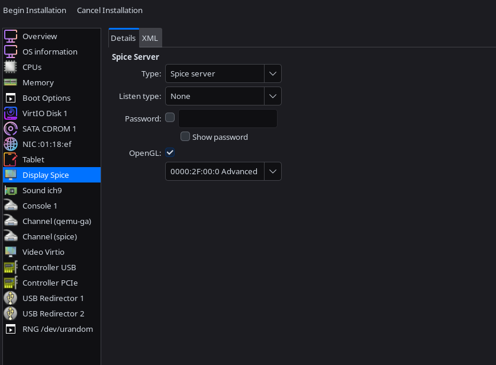


After installing the VM, I get this screen:
- 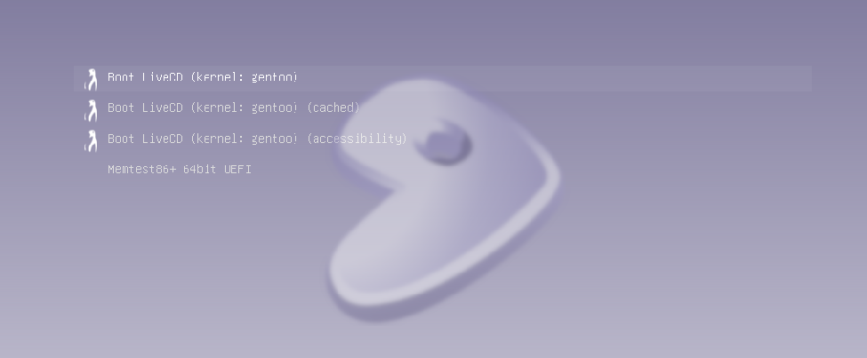

Select "Boot LiveCD (kernel: gentoo)
- 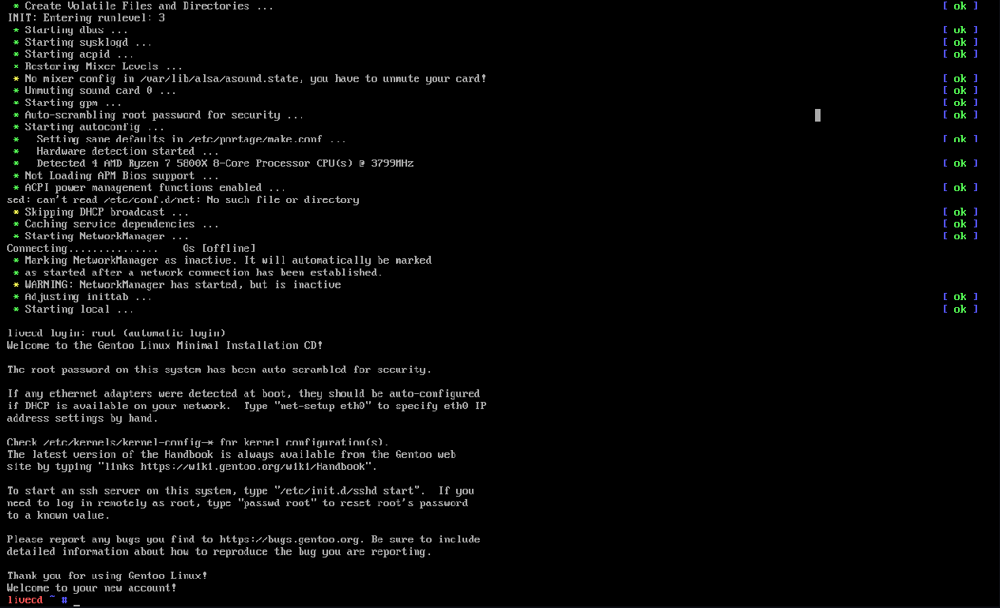

### <ins>Network Configuration</ins>

- Test the virtual network interface: `ping -c3 wiki.gentoo.org`
    - In case for some reason, this test doesn't work, make sure that there's a working virtual network interface:
        - 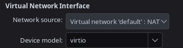
    - Or setup */etc/resolv.conf* like this:
        - 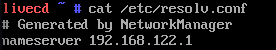

### <ins>Disk Setup</ins>

Assuming networking works, move onto disk setup. Because I'm on a virtual machine, I'm using a virtualized disk (`/dev/vda`).

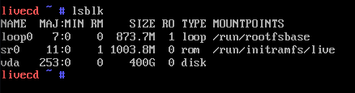

I'm using `fdisk` (Format Disk) to format and partition the virtual disk. I'll use this graph as a guide (except I want to use [btrfs](https://docs.kernel.org/filesystems/btrfs.html) for my root filesystem instead of xfs).

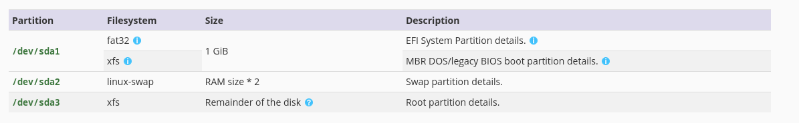

This is the series of commands I used to format my disk:
1. `fdisk /dev/vda`
    - Starts setup for /dev/vda
2. `n`
    - Creates a new partition
3. `p`
    - Partition Type: Primary
4. `1`
    - Creates partition #1
5.  Press Enter
    - Starts Partition 1 at wherever is the next available sector
6. `+1G`
    - This means that Partition 1 starting at sector 2048 will be of size 1 GiB
7. `t`
    - We're selecting the type of our partition
8. `ef`
    - 0xEF corresponds to "EFI (FAT12/16/32)"
9. `n`
    - Creates a new partition
10. `p`
    - Partition Type: Primary
11. `2`
    - Creates partition #2
12. Press Enter
    - Starts Partition 1 at wherever is the next available sector
13. `+16G`
    - I have 8GiB of RAM, so I'll use 16 GiB for the swap. Likely a bit much for this system, but I'm lazy and I don't care lol
14. `t`
    - We're selecting the type of our partition
15. `2`
    - Selects partition #2
16. `82`
    - 0x82 corresponds to "Linux swap"
17. `n`
    - Creates a new partition
18. `p`
    - Partition Type: Primary
19. `3`
    - Creates partition #3
20. Press Enter
    - Starts Partition 1 at wherever is the next available sector
21. Press Enter
    - Use the rest of the disk for the root partition
22. `w`
    - Writes to the partition table and creates the partitions on the disk

Now to actually format the partitions:

- EFI Partition (/dev/vda1)
    - `mkfs.vfat -F32 /dev/vda1`
        - This means to "make filesystem that is FAT32 on /dev/vda1 (the first partition)"
- Swap Partition (/dev/vda2)
    - `mkswap /dev/vda2`
    - `swapon /dev/vda2`
- Root Partition (/dev/vda3)
    - `mkfs.btrfs /dev/vda3`

Now to mount the root and boot partitions:

1. `mkdir -p /mnt/gentoo`
2. `mount /dev/vda3 /mnt/gentoo`
3. `mkdir -p /mnt/gentoo/boot`
4. `mount /dev/vda1 /mnt/gentoo/boot`

### <ins>Stage File Installation</ins>

The partitions created and mounted. It's time to get the stage file for Gentoo, which is an archive containing all necessary files to run a minimal Gentoo build. To acquire it:

1. `cd /mnt/gentoo`
2. `links https://www.gentoo.org/downloads/mirrors/`
    - Scroll down to the regions screen:
        - 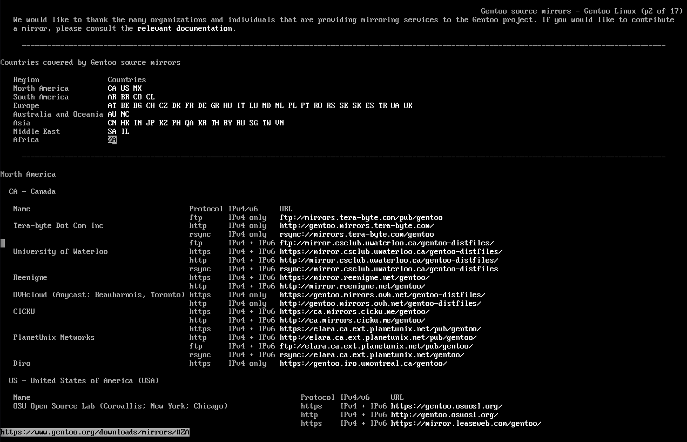
    - Pick a mirror URL (I just picked the first one)
        - 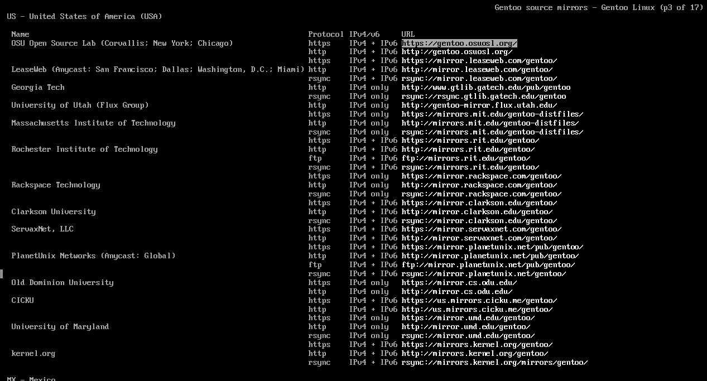
    - Go to *releases* --> *amd64* --> *autobuilds* --> *current-stage3-amd64-desktop-openrc*
    - Download the latest .tar.xz file
        - 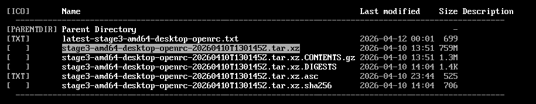
3. `tar -xpvf ./stage3-*.tar.xz --xattrs-include='*.*' --numeric-owner -C /mnt/gentoo`

### <ins>Base System Installation</ins>

Now that I have the base files for our Gentoo build, time to configure some options for Portage, Gentoo's package management system:

- `cp --dereference /etc/resolv.conf /mnt/gentoo/etc/`
- `nano /mnt/gentoo/etc/portage/make.conf`
```
# Global Compiler Flags
COMMON_FLAGS="-march=native -O2 -pipe"
CFLAGS="${COMMON_FLAGS}"
CXXFLAGS="${COMMON_FLAGS}"
FCFLAGS="${COMMON FLAGS}"
FFLAGS="${COMMON_FLAGS}"
RUSTFLAGS="${RUSTFLAGS} -C target-cpu=native"
MAKEOPTS="-j1"
NINJAOPTS="-j1"

# Locale Settings
LC_MESSAGES=C.UTF-8
```

Of course, I will add to the make.conf later. For now, it's time to add the other filesystems for /proc, /sys, /dev/, and /run:
- /proc: A pseudo-filesystem for the Linux kernel
- /sys: A pseudo-filesystem like /proc and was designed to be the successor to /proc
- /dev: A regular filesystem which contains all devices and is managed by a device manager (usually `udev`)
- /run: A tempoarary filesystem used for files generated at runtime, such as PID files and locks

1. `mount --types proc /proc /mnt/gentoo/proc`
2. `mount --rbind /sys /mnt/gentoo/sys`
3. `mount --make-rslave /mnt/gentoo/sys`
4. `mount --rbind /dev /mnt/gentoo/dev`
5. `mount --make-rslave /mnt/gentoo/dev`
6. `mount --bind /run /mnt/gentoo/run`
7. `mount --make-slave /mnt/gentoo/run`

Now that the virtual filesystems are installed, it's time to chroot (Change Root) to the install location (/mnt/gentoo):

1. `chroot /mnt/gentoo /bin/bash`
2. `source /etc/profile`
3. `export PS1="(chroot) ${PS1}`
    - The screen should now look like this:
        - 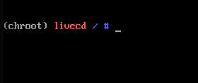
4. `rm ./stage3-*.tar.xz`

### <ins>How To Resume Install</ins>

**Warning: This step is not needed after the [Bootloader](#bootloader-installation) section below. At that point, you should be able to just boot into the actual disk instead of the ISO.**

This is a good stopping point here and I'll include this little section here since I know I will be on and off from this install. This section will show how to get back in the install root to resume the process because I'm trying to have a life lol

1. `mount /dev/vda3 /mnt/gentoo`
2. `mount /dev/vda1 /mnt/gentoo/boot`
3. `swapon /dev/vda2`
4. `mount --types proc /proc /mnt/gentoo/proc`
5. `mount --rbind /sys /mnt/gentoo/sys`
6. `mount --make-rslave /mnt/gentoo/sys`
7. `mount --rbind /dev /mnt/gentoo/dev`
8. `mount --make-rslave /mnt/gentoo/dev`
9. `mount --bind /run /mnt/gentoo/run`
10. `mount --make-slave /mnt/gentoo/run`
11. `chroot /mnt/gentoo /bin/bash`
12. `source /etc/profile`
13. `export PS1="(chroot) ${PS1}"`

After seeing this screen, continue to whichever section you left off:
- 

### <ins>Base System Configuration</ins>

After mounting the virtual filesystems and changing root, we need to setup our Base System as a Binary Host. This allows us for quicker and easier package installs. First, we need to setup our binhost conf file:
- `nano /etc/portage/binrepos.conf/gentoo.conf`

```
[gentoo]
priority = 9959
sync-uri = https://distfiles.gentoo.org/releases/amd64/binpackages/23.0/x86-64/
location = /var/cache/binhost/gentoo
verify-signature = true

[gentoo-x86-64-v3]
priority = 9959
sync-uri = https://distfiles.gentoo.org/releases/amd64/binpackages/23.0/x86-64-v3/
location = /var/cache/binhost/gentoo-x86-64-v3
verify-signature = true
```

Edit *make.conf* and add these lines:
- `vim /etc/portage/make.conf`
    - The Gentoo wiki recommends using --usepkgonly, but I'm not going to do that since that option hides a lot of important informtion like USE flag conflicts and how to resolve said conflicts. But if you want to use that option, go ahead. Also of course, replace `jobs {N}` with the number of processing cores.

```
# Portage Settings
FEATURES="${FEATURES} getbinpkg binpkg-request-signature"
EMERGE_DEFAULT_OPTS="--getbinpkg --with-bdeps=y --binpkg-respect-use=y --jobs 4"
```

To setup the base system:

1. `emerge --sync`
    - Synchronizes your local system to remote mirrors that might have updated packages
    - Equivalent to `pacman -Syy` for you Arch folks...ugh!
2. `emerge -avq1 app-portage/mirrorselect`
    - 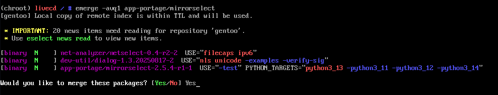
3. `mirrorselect -i -o >> /etc/portage/make.conf`
    - I pretty much just selected all U.S mirrors
    - 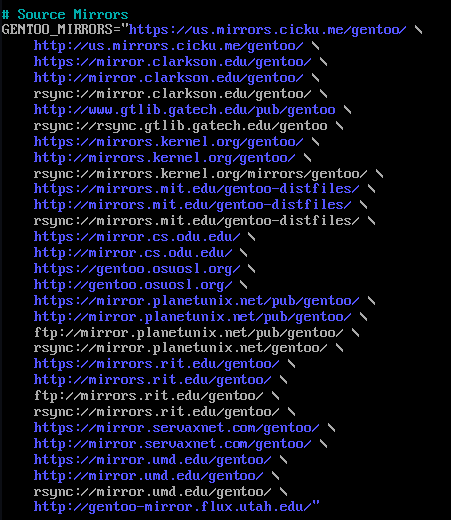
4. `emerge -avq app-misc/screen app-portage/eix`
    - I need this so I can be able to scroll up and down in a virtual terminal because a lot of the output can go beyond what I can see on the normal screen
    - To view current sessions: `screen -ls`
    - To start and name a session: `screen -S {name}`
    - To scroll up or down: press **Ctrl+a** --> **Escape**
        - This will put you in "copy mode" and you can scroll with the arrow keys or Page Up or Page Down
    - To detach a session, press **Ctrl+a** --> **d**
    - To reattach a session: `screen -r {name}`
    - To delete a session after detaching: `screen -S {name} -X quit`
    - To wipe dead sessions: `screen -wipe`
5. `eselect profile list`
6. `eselect profile set 7`
    - I want KDE Plasma...because of course I do.
    - But, of course, choose any profile you want
    - In the future, it may not be the 7th option
    - 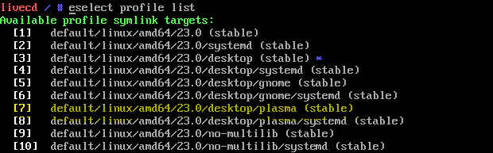
7. `emerge -avq1 app-portage/cpuid2cpuflags`
8. `echo "*/* $(cpuid2cpuflags)" > /etc/portage/package.use/00cpu-flags`
9. `echo "*/* VIDEO_CARDS: -* virgl" > /etc/portage/package.use/00video_cards`
    - Since I'm using a Virtual Machine with a virtualized GPU, the Video Card I'm using will be `virgl`
    - For NVIDIA: `echo "*/* VIDEO_CARDS: -* nvidia" > /etc/portage/package.use/00video_cards`
    - For AMD: `echo "*/* VIDEO_CARDS: -* amdgpu radeonsi" > /etc/portage/package.use/00video_cards`
    - For Intel: `echo "*/* VIDEO_CARDS: -* intel" > /etc/portage/package.use/00video_cards`
10. `nano /etc/portage/make.conf`
```
# Portage Settings
USE="bindist \
    -bluetooth \
    dbus \
    dist-kernel \
    -dvd \
    elogind \
    ffmpeg \
    -gnome \
    kde \
    multilib \
    pipewire \
    -systemd \
    vaapi \
    vulkan \
    wayland \
    X"
ACCEPT_KEYWORDS="amd64"
ACCEPT_LICENSE="-* @FREE @BINARY-REDISTRIBUTABLE"
```
11. I needed to resolve some masked packaged due to configuration conflicts. This is what I did to resolve those conflicts:
    - `mkdir /etc/portage/package.use/media-video`
    -  `nano /etc/portage/package.use/media-video/pipewire`
```
media-video/pipewire bluetooth extra -ffmpeg pipewire-alsa sound-server
```
12. `emerge --ask --quiet --update --deep --changed-use @world`
    - This command updates your system's packages
    - Equivalent to `pacman -Syu` for all you Arch folks out there...ugh!
13. `ln -svf /usr/share/zoneinfo/America/{ZONE} /etc/localtime`
14. `nano /etc/locale.gen`
    - Uncomment: `en_US`
15. `locale-gen`
16. `eselect locale list`
17. C.UTF-8 should already be selected, but in case if it is not: `eselect locale set 2`
    - If "C.UTF-8" is not the second option, change that number
18. `env-update && source /etc/profile && export PS1="(chroot) ${PS1}"`

### <ins>Kernel Configuration</ins>

From the previous section, I have installed the base Portage system. Now it's time to install system's microcode and the distribution kernel.

1. `mkdir /etc/portage/package.use/sys-kernel`
2. `nano /etc/portage/package.use/sys-kernel/installkernel`
```
sys-kernel/installkernel dracut grub
```
3. `mkdir /etc/dracut.conf.d`
4. `blkid`
5. `nano /etc/dracut.conf.d/00-installkernel.conf`
    - Read [this page](https://wiki.gentoo.org/wiki/Installkernel#Install_chroot_check) if you want to know why we need to do this.
```
kernel_cmdline=" root=UUID={Root Partition UUID} "
```
6. `emerge -avq sys-firmware/sof-firmware sys-kernel/installkernel sys-kernel/dracut sys-kernel/linux-firmware sys-kernel/gentoo-kernel-bin`

### <ins>Fstab and Network Configuration</ins>

1. `nano /etc/fstab`
```
/dev/vda1   /boot   vfat    defaults            0 2
/dev/vda2   none    swap    sw                  0 0
/dev/vda3   /       btrfs   defaults,noatime    0 1
```

2. `echo {System Name} > /etc/hostname`
3. `nano /etc/conf.d/hostname`
```
hostname="{System Name}"
```
4. `emerge -avq net-misc/dhcpcd`
5. `rc-update add dhcpcd default`
6. `emerge -avq net-misc/networkmanager`
7. `rc-update add NetworkManager default`
8. `emerge --ask --noreplace net-misc/netifrc`
9. `nano /etc/conf.d/net`
```
config_{INTERFACE}="dhcp"
```
10. `cd /etc/init.d`
11. `ln -sv net.lo net.{INTERFACE}`
12. `rc-update add net.{INTERFACE} default`
13. `nano /etc/hosts`
```
127.0.0.1   {HOSTNAME}.homenetwork  {HOSTNAME}  localhost
::1         {HOSTNAME}.homenetwork  {HOSTNAME}  localhost
```
14. `passwd`
15. `cd`

### <ins>Bootloader Installation</ins>

Our filesystem table and networking should be all set up now. Now time to install the bootloader (I'm using GRUB because of course I am):
1. `emerge -avq app-admin/sysklogd && rc-update add sysklogd default`
2. `emerge -avq sys-process/cronie && rc-update add cronie default`
3. `emerge -avq net-misc/chrony && rc-update add chronyd default`
4. `emerge -avq net-dns/bind sys-apps/mlocate app-shells/bash-completion app-shells/fish app-shells/zsh sys-block/io-scheduler-udev-rules sys-fs/btrfs-progs sys-fs/xfsprogs sys-fs/e2fsprogs sys-fs/dosfstools sys-fs/ntfs3g sys-fs/zfs`
5. `echo 'GRUB_PLATFORMS="efi-64"' >> /etc/portage/make.conf`
6. `emerge --ask --verbose --quiet --update --newuse sys-boot/grub`
7. `grub-install --efi-directory=/boot`
    - You should get this screen:
        - 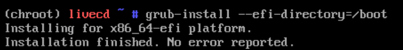
8. `grub-mkconfig -o /boot/grub/grub.cfg`
    - You should get something like this:
        - 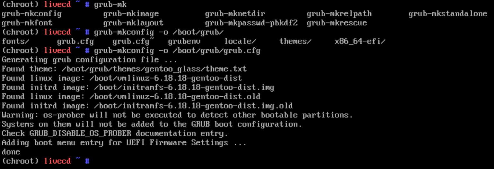
        - **Warning: You should see at least one kernel image and one initrd image. If not, something is messed up. Check `/boot` and redo the [kernel and initramfs install process](#kernel-configuration)**
9. Exit out of the chroot, unmount the virtual filesystems, and reboot/shutdown the system
    - `exit`
    - `cd`
    - `umount -l /mnt/gentoo/dev{/shm,/pts,}`
    - `umount -R /mnt/gentoo`
    - `reboot`

### <ins>User Administration</ins>

I now have a Gentoo install on my virtual disk and I can now boot into it without the ISO. Booting into the VM should look like this:
- 

Next step is to create a user and attach it to the Fish shell since I prefer Fish over Bash:

1. `useradd -m -G users,wheel,audio,video -s /bin/fish {USER}`
2. `passwd {USER}`
3. `mkdir /etc/portage/package.use/app-admin`
4. `nano /etc/portage/package.use/app-admin/doas`
```
app-admin/doas persist
```
5. `emerge -avq app-admin/doas app-editors/vim`
6. `vim /etc/doas.conf`
```
permit persist :wheel
```

To test if the newly created user can escalate permissions, login as the user and disable root login for added security:

1. `exit`
2. login: {USER}

Don't have to do this, but I'll reboot at this time:
- `doas reboot`

### <ins>Desktop Installation</ins>

At this point, my newly created user should be able to install the rest of the system I want. Right now, I want to be able to install my desktop, which will be [KDE Plasma](https://wiki.gentoo.org/wiki/KDE), but feel free to use a different desktop environment:

1. `doas mkdir /etc/portage/package.use/dev-qt`
2. `doas vim /etc/portage/package.use/dev-qt/qtpositioning`
```
dev-qt/qtpositioning geoclue
```
3. `doas emerge --pretend --getbinpkg --usepkgonly --binpkg-respect-use=n dev-qt/qtwebengine media-libs/opencv`
    - I'm doing this specifically because OpenCV and QTWebengine takes forever to compile and I want to make sure I install the binaries
    - *Use this in general if you have a package in mind you want to install as a binary but want to know which USE flags are needed to get it*
    - These are the use flags I need to install QTWebengine as a binary:
        - 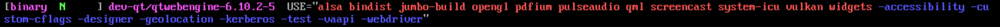
        - **Apparently, I need to disable vaapi to install QTWebengine as a binary and I need to enable the intel GPU for media-libs/opencv**
4. `doas vim /etc/portage/package.use/dev-qt/qtwebengine`
```
dev-qt/qtwebengine -vaapi
```
5. `doas mkdir /etc/portage/package.use/media-libs`
6. `doas vim /etc/portage/package.use/media-libs/opencv`
```
media-libs/opencv -vaapi
```
7. `doas mkdir /etc/portage/package.use/www-client`
8. `doas vim /etc/portage/package.use/www-client/falkon`
```
www-client/falkon -kde
```
7. `doas vim /etc/portage/package.use/00video_cards`
```
*/* VIDEO_CARDS: -* virgl
media-libs/opencv VIDEO_CARDS: -\* intel virgl
```
8. `doas emerge --ask --verbose --quiet --update --deep --changed-use @world`
    - Need to do this now that I've been changing the USE flag settings
9. `doas emerge -avq kde-plasma/plasma-meta kde-apps/kde-apps-meta`
    - **This is going to take a little while**
10. `doas rc-update add elogind boot`
11. `doas rc-update add dbus default`
12. `doas usermod -aG pipewire {USER}`
13. `vim ~/.config/kwalletrc`
```
[Wallet]
Enabled=false
```
14. `doas vim /etc/conf.d/display-manager`
```
DISPLAYMANAGER="sddm"
```
15. `doas rc-update add display-manager default`
16. `doas vim /etc/doas.conf`
```
permit persist :wheel
permit nopass {USER} as root cmd /sbin/reboot
permit nopass {USER} as root cmd /sbin/poweroff
```
17. `vim ~/.config/fish/functions/reboot.fish`
```
function reboot
    doas reboot $argv
end
```
18. `vim ~/.config/fish/functions/poweroff.fish`
```
function poweroff
    doas poweroff $argv
end
```
19. `vim ~/.config/fish/functions/sudo.fish`
```
function sudo
    doas $argv
end
```
20. `reboot`

At this point, I'm now booted into a KDE plasma desktop:
- 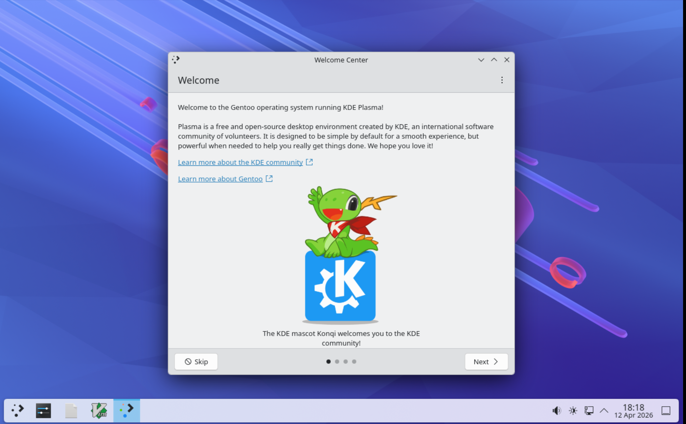

### <ins>Finishing Touches</ins>

After booting into KDE plasma, now to install the rest using Konsole. I've already shown how to configure the system to install a specific package as a binary.

Install Eselect Repository (this is so our system can manage other repos to access other packages not included in the standard Gentoo repo):

- `doas emerge -avqn app-eselect/eselect-repository`

Install Librewolf (my browser of choice but feel free to replace it with something else):

- `doas eselect repository add librewolf git https://codeberg.org/librewolf/gentoo.git`
- `doas emerge --sync`
- `doas emerge -avq www-client/librewolf-bin`

Install Wine & Steam:

- `doas mkdir /etc/portage/package.use/app-emulation`
- `doas vim /etc/portage/package.use/app-emulation/wine-proton`
```
app-emulation/wine-proton -abi_x86_32
```
- `doas emerge -avq virtual/wine app-emulation/wine-vanilla app-emulation/wine-proton`
- `doas eselect repository enable steam-overlay`
- `doas emerge --sync`
- `doas mkdir /etc/portage/package.use/games-util`
- `doas vim /etc/portage/package.use/games-util/steam`
    - Because the Proton runtime built into Steam requires the 32-bit binaries of a lot of dependencies, we are going to include the `abi_x86_32` use flag for a ton of dependencies in this file:
```
app-accessibility/at-spi2-core    abi_x86_32
app-arch/bzip2                    abi_x86_32
app-arch/lz4                      abi_x86_32
app-arch/xz-utils                 abi_x86_32
app-arch/zstd                     abi_x86_32
app-crypt/p11-kit                 abi_x86_32
dev-db/sqlite                     abi_x86_32
dev-lang/rust                     abi_x86_32
dev-lang/rust-bin                 abi_x86_32
dev-libs/dbus-glib                abi_x86_32
dev-libs/elfutils                 abi_x86_32
dev-libs/expat                    abi_x86_32
dev-libs/fribidi                  abi_x86_32
dev-libs/glib                     abi_x86_32
dev-libs/gmp                      abi_x86_32
dev-libs/icu                      abi_x86_32
dev-libs/json-glib                abi_x86_32
dev-libs/leancrypto               abi_x86_32
dev-libs/libevdev                 abi_x86_32
dev-libs/libffi                   abi_x86_32
dev-libs/libgcrypt                abi_x86_32
dev-libs/libgpg-error             abi_x86_32
dev-libs/libgudev                 abi_x86_32
dev-libs/libgusb                  abi_x86_32
dev-libs/libpcre2                 abi_x86_32
dev-libs/libtasn1                 abi_x86_32
dev-libs/libunistring             abi_x86_32
dev-libs/libusb                   abi_x86_32
dev-libs/libxml2                  abi_x86_32
dev-libs/lzo                      abi_x86_32
dev-libs/nettle                   abi_x86_32
dev-libs/nspr                     abi_x86_32
dev-libs/nss                      abi_x86_32
dev-libs/openssl                  abi_x86_32
dev-libs/wayland                  abi_x86_32
dev-util/glslang                  abi_x86_32
dev-util/spirv-tools              abi_x86_32
dev-util/sysprof-capture          abi_x86_32
dev-util/vulkan-utility-libraries abi_x86_32
gnome-base/librsvg                abi_x86_32
gui-libs/egl-gbm                  abi_x86_32
gui-libs/egl-wayland              abi_x86_32
gui-libs/egl-wayland2             abi_x86_32
gui-libs/egl-x11                  abi_x86_32
gui-libs/libdecor                 abi_x86_32
llvm-core/clang                   abi_x86_32
llvm-core/llvm                    abi_x86_32
media-gfx/graphite2               abi_x86_32
media-libs/alsa-lib               abi_x86_32
media-libs/flac                   abi_x86_32
media-libs/fontconfig             abi_x86_32
media-libs/freetype               abi_x86_32
media-libs/glu                    abi_x86_32
media-libs/harfbuzz               abi_x86_32
media-libs/lcms                   abi_x86_32
media-libs/libdisplay-info        abi_x86_32
media-libs/libepoxy               abi_x86_32
media-libs/libglvnd               abi_x86_32
media-libs/libjpeg-turbo          abi_x86_32
media-libs/libogg                 abi_x86_32
media-libs/libpng                 abi_x86_32
media-libs/libpulse               abi_x86_32
media-libs/libsdl2                abi_x86_32
media-libs/libsndfile             abi_x86_32
media-libs/libva                  abi_x86_32
media-libs/libvorbis              abi_x86_32
media-libs/libwebp                abi_x86_32
media-libs/mesa                   abi_x86_32
media-libs/openal                 abi_x86_32
media-libs/opus                   abi_x86_32
media-libs/tiff                   abi_x86_32
media-libs/vulkan-layers          abi_x86_32
media-libs/vulkan-loader          abi_x86_32 layers
media-sound/lame                  abi_x86_32
media-sound/mpg123-base           abi_x86_32
media-video/pipewire              abi_x86_32
net-dns/c-ares                    abi_x86_32
net-dns/libidn2                   abi_x86_32
net-libs/gnutls                   abi_x86_32
net-libs/libasyncns               abi_x86_32
net-libs/libndp                   abi_x86_32
net-libs/libpsl                   abi_x86_32
net-libs/nghttp2                  abi_x86_32
net-libs/nghttp3                  abi_x86_32
net-libs/ngtcp2                   abi_x86_32
net-misc/curl                     abi_x86_32
net-misc/networkmanager           abi_x86_32
net-print/cups                    abi_x86_32
sys-apps/dbus                     abi_x86_32
sys-apps/lm-sensors               abi_x86_32
sys-apps/systemd                  abi_x86_32
sys-apps/systemd-utils            abi_x86_32
sys-apps/util-linux               abi_x86_32
sys-libs/gdbm                     abi_x86_32
sys-libs/gpm                      abi_x86_32
sys-libs/libcap                   abi_x86_32
sys-libs/libudev-compat           abi_x86_32
sys-libs/ncurses                  abi_x86_32
sys-libs/pam                      abi_x86_32
sys-libs/readline                 abi_x86_32
sys-libs/zlib                     abi_x86_32
virtual/glu                       abi_x86_32
virtual/libelf                    abi_x86_32
virtual/libiconv                  abi_x86_32
virtual/libintl                   abi_x86_32
virtual/libudev                   abi_x86_32
virtual/libusb                    abi_x86_32
virtual/opengl                    abi_x86_32
virtual/zlib                      abi_x86_32
x11-drivers/nvidia-drivers        abi_x86_32
x11-libs/cairo                    abi_x86_32
x11-libs/extest                   abi_x86_32
x11-libs/gdk-pixbuf               abi_x86_32
x11-libs/gtk+                     abi_x86_32
x11-libs/libdrm                   abi_x86_32
x11-libs/libICE                   abi_x86_32
x11-libs/libpciaccess             abi_x86_32
x11-libs/libSM                    abi_x86_32
x11-libs/libvdpau                 abi_x86_32
x11-libs/libX11                   abi_x86_32
x11-libs/libXau                   abi_x86_32
x11-libs/libxcb                   abi_x86_32
x11-libs/libXcomposite            abi_x86_32
x11-libs/libXcursor               abi_x86_32
x11-libs/libXdamage               abi_x86_32
x11-libs/libXdmcp                 abi_x86_32
x11-libs/libXext                  abi_x86_32
x11-libs/libXfixes                abi_x86_32
x11-libs/libXft                   abi_x86_32
x11-libs/libXi                    abi_x86_32
x11-libs/libXinerama              abi_x86_32
x11-libs/libxkbcommon             abi_x86_32
x11-libs/libXrandr                abi_x86_32
x11-libs/libXrender               abi_x86_32
x11-libs/libXScrnSaver            abi_x86_32
x11-libs/libxshmfence             abi_x86_32
x11-libs/libXtst                  abi_x86_32
x11-libs/libXxf86vm               abi_x86_32
x11-libs/pango                    abi_x86_32
x11-libs/pixman                   abi_x86_32
x11-libs/xcb-util-keysyms         abi_x86_32
x11-misc/colord                   abi_x86_32
```
- `doas mkdir /etc/portage/package.accept_keywords/games-util`
- `doas vim /etc/portage/package.accept_keywords/games-util/steam-launcher`
```
*/*::steam-overlay
games-util/game-device-udev-rules
sys-libs/libudev-compat
```
- `doas mkdir -p /etc/portage/package.license/games-util`
- `doas vim /etc/portage/package.license/games-util/steam-launcher`
```
games-util/steam-launcher ValveSteamLicense
```
- `doas emerge -avq games-util/steam-launcher app-misc/fastfetch sys-process/htop`

Install Discord:

- `doas mkdir /etc/portage/package.license/net-im`
- `doas vim /etc/portage/package.license/net-im/discord`
```
net-im/discord all-rights-reserved
```
- `doas emerge -avq net-im/discord`

Install Bitwarden:

- `doas mkdir /etc/portage/package.accept_keywords/app-admin`
- `doas vim /etc/portage/package.accept_keywords/app-admin/bitwarden`
```
app-admin/bitwarden-desktop-bin ~amd64
```
- `doas emerge -avq app-admin/bitwarden-desktop-bin`

Install VSCodium:

- `doas emerge -avq app-editors/vscodium`

Install Libreoffice:

- `doas emerge -avq app-office/libreoffice-bin`

Install Libvirt and Virtual Machine Manager:

- `doas mkdir /etc/portage/package.use/net-dns`
- `doas mkdir /etc/portage/package.use/net-libs`
- `doas mkdir /etc/portage/package.use/net-misc`
- `doas vim /etc/portage/package.use/net-dns/dnsmasq`
```
net-dns/dnsmasq script
```
- `doas vim /etc/portage/package.use/net-libs/gnutls`
```
net-libs/gnutls pkcs11 tools
```
- `doas vim /etc/portage/package.use/net-misc/spice-gtk`
```
net-misc/spice-gtk usbredir
```
- `doas vim /etc/portage/package.use/app-emulation/libvirt`
```
app-emulation/libvirt virt-network qemu udev -fuse -virtualbox
```
- `doas vim /etc/portage/package.use/app-emulation/qemu`
```
app-emulation/qemu -pulseaudio -wayland QEMU_SOFTMMU_TARGETS: x86_64
```

- `doas emerge -avq app-emulation/qemu app-emulation/libvirt app-emulation/virt-manager`
- `doas usermod -aG libvirt {USER}`
- `doas rc-service libvirtd start`
- `doas rc-update add libvirtd default`

Install Game Emulators:

- `doas mkdir /etc/portage/package.license/games-emulation`
- `doas vim /etc/portage/package.license/games-emulation/dolphin`
```
games-emulation/dolphin FatFs
```
- `doas emerge -avq games-emulation/pcsx2 games-emulation/dolphin`

Install [Snapper](https://wiki.gentoo.org/wiki/Snapper#Rollback) to allow for System Backups:

- `doas emerge -avq app-backup/snapper`
- `doas snapper -c root create-config /`
- `doas snapper create --type single --description "Test Snapshot"`
    - You should see a snapshot in */.snapshots*

Install [grub-btrfs](git clone https://github.com/Antynea/grub-btrfs.git)

- `doas eselect repository enable guru`
- `doas emerge --sync`
- `doas mkdir /etc/portage/package.accept_keywords/app-backup`
- `doas vim /etc/portage/package.accept_keywords/app-backup/grub-btrfs`
```
app-backup/grub-btrfs ~amd64
```
- `doas emerge -avq app-backup/grub-btrfs`
- `doas vim /etc/default/grub-btrfs/config`
```
GRUB_BTRFS_GRUB_DIRNAME="/boot/grub"
GRUB_BTRFS_MKCONFIG=/usr/sbin/grub-mkconfig
GRUB_BTRFS_SCRIPT_CHECK=grub-script-check
```
- Test grub-mkconfig: `doas grub-mkconfig -o /boot/grub/grub.cfg`
    - You should see something like this:
        - 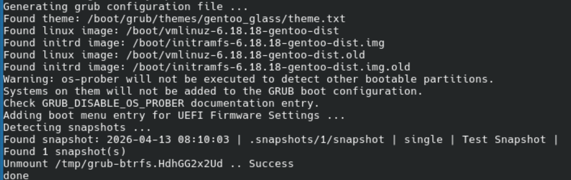

- After a few hours, there should be a few snapshots that are taken hourly:
    - 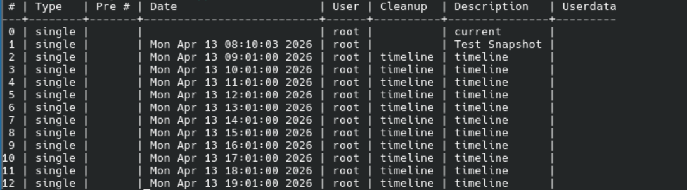

- `doas emerge -avq app-admin/btrfs-assistant`

As one final measure, sync, update the world set, and remove unneeded packages:

- `doas emerge --noreplace app-editors/nano app-portage/cpuid2cpuflags app-portage/mirrorselect app-crypt/sbsigntools app-arch/7zip`
- `doas emerge --sync && emerge --ask --verbose --update --deep --changed-use @world`
- `doas emerge -ac`
- `reboot`
    - You should see snapshots here:
        - 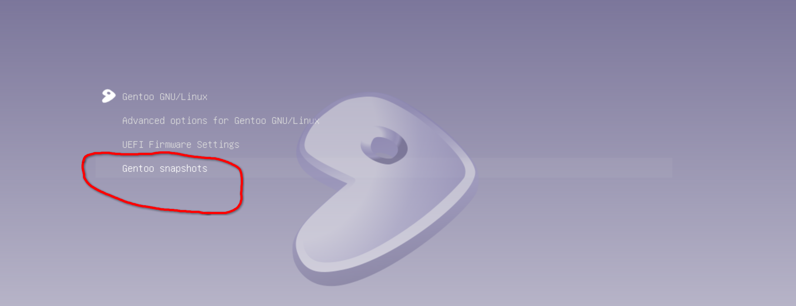
        - 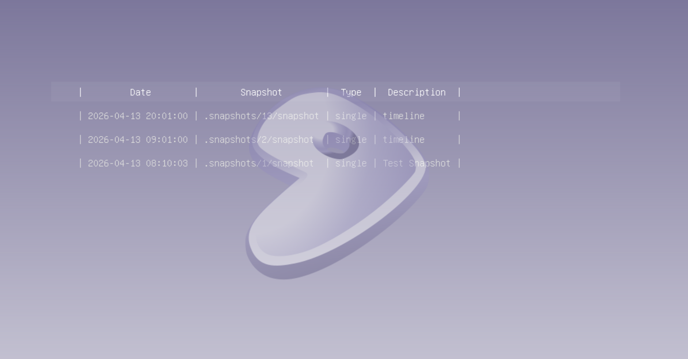

**Yay! I am now done installing Gentoo on a Virtual Machine! Now to do this for real!!!**

## Installing on Real Hardware

[TBD]
